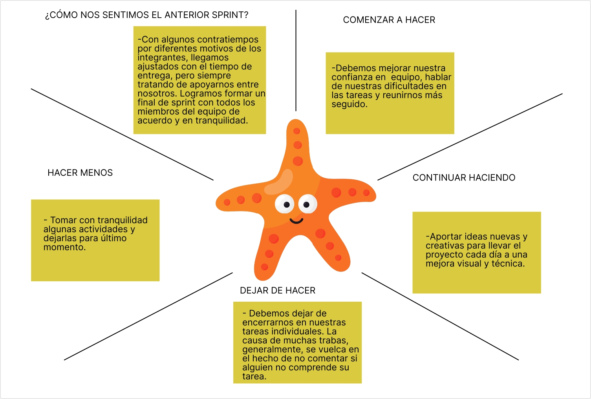

 4/10/23

 
Soy alexander y hoy hasta mañana me comprometo en mejorar el diseño en figma del carrito de compras =)

Soy Liliana y me comprometo en presentar mañana un boceto responsive de login en figma

Soy Gabriel ayer empecé el boceto de seccion de registro, hoy lo retoqué y empecé a hacerlo responsive, mañana seguiré retocandolo.

5/10/23

Soy Gabriel hoy terminé el boceto de formulario de registros, mañana me comprometo a seguir con la seccion de detalles de productos

6/10/23

Soy Gabriel hoy terminé el desktop del boceto de detalles de productos y mañana me comprometo a seguir trabajandolo

7/10/23

Soy Gabriel hoy terminé con los bocetos responsive de la seccion de detalles de productos.

| Retrospectiva Sprint 1 |

3/11/23

¿Cómo nos sentimos durante el primer Sprint?

En general charlando llegamos a la conclusión de que nos sentimos cómodos como grupo e intentamos siempre comunicarnos cualquier tipo de duda para poder tener cada vez más confianza entre nosotros, cosa que generaría más emoción por trabajar juntos y poder unirnos como compañeros.

¿Qué hicimos bien durante este periodo?

Estamos todos de acuerdo e hicimos bastanta énfasis en que habia buena comunicación en cuanto a dudas o problemas, más allá solamente del trabajo a realizar, empzando a conocer quizá los fuertes de cada uno en diferentes áreas.

¿Qué aprendimos?

Como primer instancia de verdadero trabajo en equipo y convivencia aprendimos las bases de tener que mantener a flote la confianza y constancia comunicativa del equipo, pensamos que de a poco esto se irá fortaleciendo aún más, agregando que podemos ver que cada uno puede llegar a tener motivaciones diferentes que podrían ayudar a realizar los trabajos más eficazmente como la idea de seguir aprendiendo o reforzar lo aprendido anteriormente durante la cursada.

¿Qué deberiamos hacer de diferente del próximo Sprint?

Nos sentimos conformes con el primer Sprint en cuanto a diferentes ámbitos como la comunicación y respeto, pero pensamos que podemos mejorar estas cosas todavía más para evitar cualquier tipo de conflicto o incomodidad a la hora de trabajar, ser más participativos en el progreso del otro puesto que sino nos involucramos más podría llegar a romper un poco el vinculo que nos da ser equipo. También mejorar el manejo de jira en lo posible para mayor organización y visualización del proceso de las tareas. Haciendo enfasis en que quizá nos apresuramos demasiado al principio y más tarde nos sentiamos agotados bajando bastante el ritmo, con algunos imprevistos o pasando por alto detalles importantes en menor o mayor relevancia, si bien hay comunicación constante debemos seguir con un ritmo equilibrado y consultarnos más las cosas, lo que nos esforzaremos en implementar en esta nueva etapa.

¿Qué nos sigue desconcertando?

Siendo la primera vez que llegamos a trabajar juntos y empezar a conocernos por ahora no ha habido ningún motivo que nos haya dejado pensando o impedido trabajar más allá de lo común como falta de tiempo o algo más personal.

Análisis

Volviendo a pensar en lo antes mencionado no tenemos mucho que decir o agregar, creemos que fue una buen primer periodo y nos sentimos cómodos con lo hecho, claro pensando a futuro en posibles cambios para mejor o implementaciones aceptadas por todos los integrantes.

Definiendo una acción de mejora

Mejorar la comunicación, si bien ya hay algo decente, cada vez va a haber más dudas al ser el trabajo progresivamente más complejo.

--------------------
8/12/23
--------------------

SPRINT 2

-------------------------------------------------------------------------------- 
Cambios

Se integró un nuevo miembro (Fernando Ortiz) y la verdad nos sentimos muy 
cómodos con el, y el se adaptó rapidamente al grupo, fue a mitad del sprint
que el se unió y lo ayudamos para que pueda estar al día en su trabajo
asignado
El motivo por lo que Fer se unió al grupo fue porque su anterior equipo dejaron
de conectarse al curso, pero lo bueno que el se siente comodo en nuestro grupo.

-------------------------------------------------------------------------------
Como nos sentimos durante el segundo sprint?

La verdad que nos sentimos mucho mejor en cuanto a las conexiones que 
tenemos, quizas el lazo que nos conecta se esta reforzando.
Al ingresar fernando ortiz quizas necesitaba ser guiado un poco pero
rapidamente tomo carrera y ahora estamos muy unidos en los trabajos.

-------------------------------------------------------------------------------
Comenzar hacer

Deberiamos empezar a reunirnos unos 15 minutos en un horario fijo donde 
podamos asistir todos los integrantes del grupo.
Empezar a implementar lo de las retros.

-------------------------------------------------------------------------------
Hacer mas

Empezar a estar mas atentos al jira y al github para poder estar actualizados
ante las revisiones de los profesores (jira), y tambien estar mas atentos
a los cambios de cada rama respectiva del proyecto en github.

-------------------------------------------------------------------------------
Continuar haciendo

Seguir organizandonos de la manera en que lo haciamos, y seguir siendo
responsables cada uno con nuestra parte del proyecto, apoyandonos unos al
otro en lo que quizas nos cueste entender.

-------------------------------------------------------------------------------

-------------------------------------------------------------------------------
Hacer menos

Deberiamos sobrecargarnos menos con las tareas de proyecto, y dividir 
nuestros tiempos a lo largo de cada sprint, sin sobrecargarse.

-------------------------------------------------------------------------------

Dejar de hacer

Dejar de suponer de los demas compañeros del grupo, 
y no perder la comunicación al finalizar los sprints.

------------------------RETRO SPRINT 3-----------------------------------------

17/12/23

-------------------------------------------------------------------------------
¿Cómo nos sentimos respecto al anterior Sprint?

Charlando entre todos llegamos a la conclusión que a diferencia de los anteriores sprints este fue un poco más liviano, lo que nos ayudó a lograr entender de una manera más completa cada tarea y responsabilidad del Sprint para su finalización, respecto al nuevo integrante, notamos que gracias a su incorporación y su adaptación se nos hizo más ameno el proceso del mismo, por lo cual sirve como incentivo para de cara a un futuro poder reconocer de manera más sencilla fortalezas o debilidades de cada integrante.

-------------------------------------------------------------------------------
Comenzar a hacer

Si bien creemos que está bien organizar un horario fijo para las reuniones, también queremos empezar a cordinar un día fijo pero con un horario dinámico, para poder concretar este weekly, o también implementar reuniones de emergencias en caso de algún bloqueo o similar.

-------------------------------------------------------------------------------
Hacer más

Revisar continuamente el trabajo, en busca de mejoras ya sea visuales o funcionales, siendo fiel al estilo original.

-------------------------------------------------------------------------------
Continuar haciendo

Seguir siendo presentes en el uso de jira y github o cualquier medio de comunicación con los profesores.

-------------------------------------------------------------------------------
Hacer menos

Enfocar demasiado tiempo en una tarea extra, para poder preguntar a los demás si necesitan ayuda en caso de no haber acabado con su tarea.

-------------------------------------------------------------------------------
Dejar de hacer

Dejar tareas para los últimos días de Sprint por considerar su importancia menor a la de las demás responsabilidades.

------------------------RETRO SPRINT 4-------------------------------------------------------------------------------------------

----------------------------- 
¿Cómo nos sentimos respecto al anterior Sprint? 

Respecto al sprint anterior nos sentíamos algo preocupados por algunos descuidos a la hora de presentar las ultimas tareas hechas y entre tantas cosas que hacer nos olvidabamos de los ultimos detalles como fusionar las ramas, por otro lado sentimos que fue bastante tranquilo el desarrollo del mismo y sirvió para poder ponernos al día en diferentes temas.

------------------------------------------------------------------------------- 
Comenzar a hacer 

Hablar de cómo va el trabajo en general y realizar conversaciones de cara a la entrega final, lo que queremos presentar.

------------------------------------------------------------------------------- 

Hacer más
Preocuparse más por el trabajo de los demás, no dejar de lado nada, todo está conectado por lo que todo es importante de realizar correctamente.

------------------------------------------------------------------------------- 
Continuar haciendo 

Distribuyendo la tareas de manera que si alguien está en desacuerdo poder escucharle y discutirlo.

Seguir comprendiendo las diferentes situaciones de los integrantes, todo para llegar a un buen resultado.

------------------------------------------------------------------------------------------------------- 
Hacer menos 

Quedarse con dudas y trabajar aún con ellas.

------------------------------------------------------------------------------- 
Dejar de hacer 

Esperar que se ponga en duda el cómo va el proceso de ralización de una tarea y no comunicarlo.

---------------------------------------------------------Retro Sprint 5------------------------------------------------------------------------
----------------------------- 14/02/2024.
¿Cómo nos sentimos respecto al anterior Sprint? 

-Nos sentimos un poco mas fluidos, controlando cada vez mas los tiempos de desarrollo y entrega.
------------------------------
Comenzar a hacer 

-Mejorar la organización del grupo en cuanto a lo cooperativo

------------------------------
Hacer más

-Apoyarnos en las tareas mas complejas

------------------------------
Continuar haciendo 

-Seguir en comunicación

-------------------------------
Hacer menos 

-Dejar para ultimo ciertas actividades

-------------------------------
Dejar de hacer 

-Procrastinar 

---------------------------------------------------------Retro Sprint 6------------------------------------------------------------------------
----------------------------- 25/03/2024.

---------------------------------------------------------Retro Sprint 7------------------------------------------------------------------------

¿Cómo nos sentimos respecto al anterior Sprint? 

Hablando entre todos nos dabamos cuenta que cada vez podíamos entendernos más y reducir los conflictos en gran medida, nos sentimos satisfechos con cada sprint pero siempre con ideas nuevas que a veces nos costaba poner en marcha pero pudimos con todo como equipo, se volvió un ambiente bastante cómodo pese a las diferencias.

------------------------------------------------------------------------------- 
Comenzar a hacer 

Organizar nuevamente charlas para esta etapa final en las que discutamos detalladamente los puntos del proyecto.

------------------------------------------------------------------------------- 

Hacer más
Comunicar el proceso de las tareas individuales para un mejor seguimiento y evitar pisar detalles de otros.

------------------------------------------------------------------------------- 
Continuar haciendo 

Tomar en cuenta la opinión de todos para repartir tareas, empatizar ante cualquier inconveniente repentino.

------------------------------------------------------------------------------------------------------- 
Hacer menos 

Dedicarle tiempo a detalles secundarios.

------------------------------------------------------------------------------- 
Dejar de hacer 

No avisar sobre cambios aunque sean detalles, ya que aún si no se han mencionado podría estar un compañero mismamente trabajando en lo mismo.
